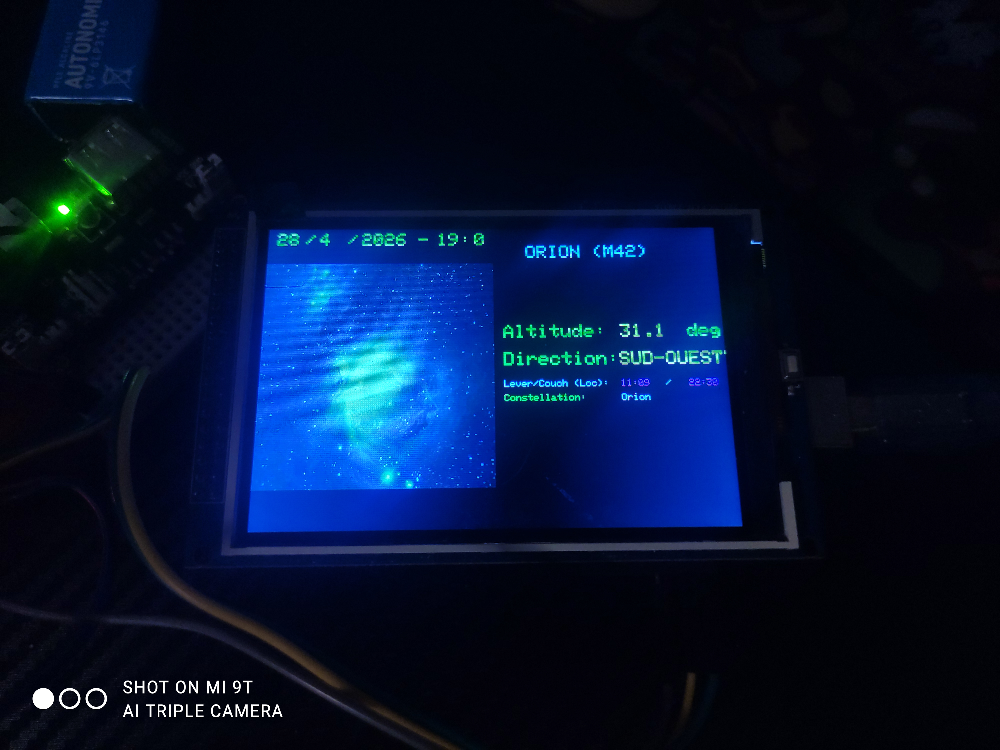
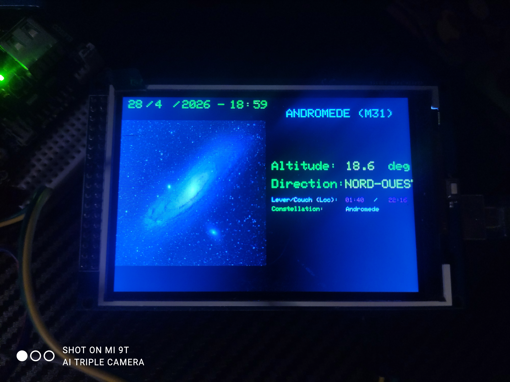

# deep-sky-objects-arduino-mega-tft
🌌 Horloge Astronomique DSO
Station info astronomique basée sur Arduino Mega. Calcule et affiche la position d'objets célèbres en temps réel.

✨ Fonctions

Suivi en direct : Calcul d'Altitude/Azimut et Lever/Coucher (Andromède, Orion, Pléiades, NGC7000, NGC2237, IC1805, ...).

Visuels : Affichage d'images BMP depuis une carte SD . Chaques images ont une résolution de 240px par 240px. 

Précision : Heure gérée par module RTC DS3231 avec gestion de l'heure d'été.

🛠️ Matériel
Arduino Mega + Écran TFT (ILI9486).

Module RTC DS3231 & Carte SD.

INFO TFT --> https://www.lcdwiki.com/3.5inch_Arduino_Display-Mega2560

🛑EDIT🛑
Ajout d'une fonction de difficulté 
Ajout d'objets : IC1805 HEART NEBULA
                 NGC2237 Rosette Nebula

